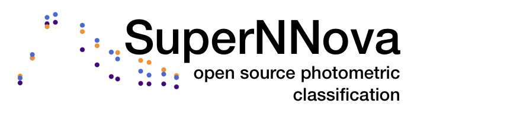

[](https://doi.org/10.1093/mnras/stz3312) 
[](https://arxiv.org/abs/1901.06384) 
[](https://doi.org/10.5281/zenodo.3265189)



[](https://travis-ci.org/supernnova/SuperNNova)

```bash
A new realease of SuperNNova is in the main branch. For DES-5yr analysis please use the branch SNANA_DES5yr (and any other analysis using the syntax: python run.py)
```

### What is SuperNNova (SNN)

SuperNNova is an open-source photometric time-series classification framework.

The framework includes different RNN architectures (LSTM, GRU, Bayesian RNNs) and can be trained with simulations in `.csv` and `SNANA FITS` format. SNN is part of the [PIPPIN](https://github.com/dessn/Pippin) end-to-end cosmology pipeline.

You can train your own model for time-series classification (binary or multi-class) using photometry and additional features.

Please include the full citation if you use this material in your research: [A Möller and T de Boissière,
MNRAS, Volume 491, Issue 3, January 2020, Pages 4277–4293.](https://academic.oup.com/mnras/article-abstract/491/3/4277/5651173)

### Read the documentation
[https://supernnova.readthedocs.io](https://supernnova.readthedocs.io/latest/)


### Installation
Clone this repository (preferred)
```bash
git clone https://github.com/supernnova/supernnova.git
```
and configure environment using this [documentation](https://supernnova.readthedocs.io/latest/installation/five_minute_guide.html)


### Read the papers

Please include the full citation if you use this material in your research: [A Möller and T de Boissière,
MNRAS, Volume 491, Issue 3, January 2020, Pages 4277–4293.](https://academic.oup.com/mnras/article-abstract/491/3/4277/5651173)

To reproduce [Möller & de Boissière, 2019 MNRAS](https://academic.oup.com/mnras/article-abstract/491/3/4277/5651173) switch to `paper` branch and build documentation.

To reproduce the Dark Energy Survey analyses use commit `fcf8584b64974ef7a238eac718e01be4ed637a1d`. For more recent analyses of DES branch `SNANA_DES5yr` (should be PIPPIN backward compatible).
- [Möller et al. 2022 MNRAS](https://ui.adsabs.harvard.edu/abs/2022MNRAS.514.5159M/abstract)
- [Möller et al. 2024 MNRAS](https://ui.adsabs.harvard.edu/abs/2024MNRAS.533.2073M/abstract)
- [Vincenzi et al. 2023 MNRAS](https://ui.adsabs.harvard.edu/abs/2023MNRAS.518.1106V/abstract)
- [DES Collaboration 2024 ApJ](https://ui.adsabs.harvard.edu/abs/2024ApJ...973L..14D/abstract)

To reproduce Fink analyses until 2024 use commit `fcf8584b64974ef7a238eac718e01be4ed637a1d` and check [Fink's github](https://github.com/astrolabsoftware/fink-science).

### Build docs <a name="docs"></a>

    cd docs && make clean && make html && cd ..
    firefox docs/_build/html/index.html


### ADACS
This package has been updated to a recent pytorch and updated CI/CD through the [ADACS Merit allocation program](https://adacs.org.au/merit-allocation-program) 2023-2024.
