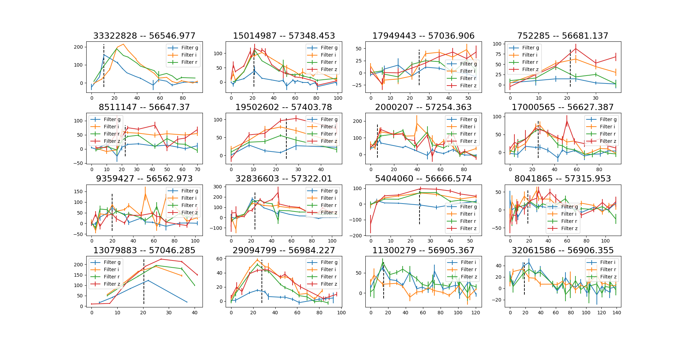
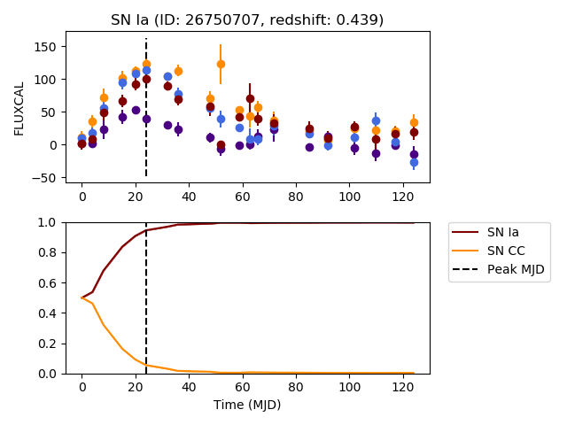
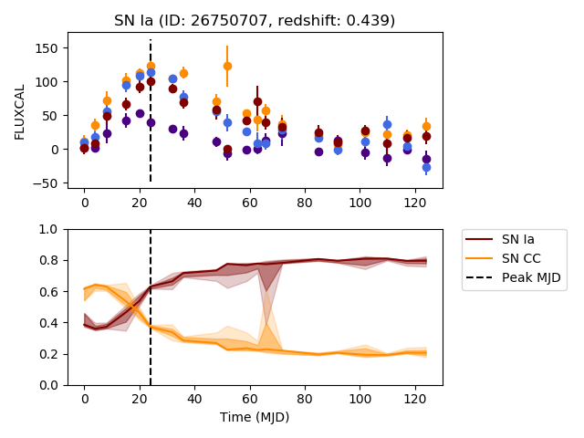
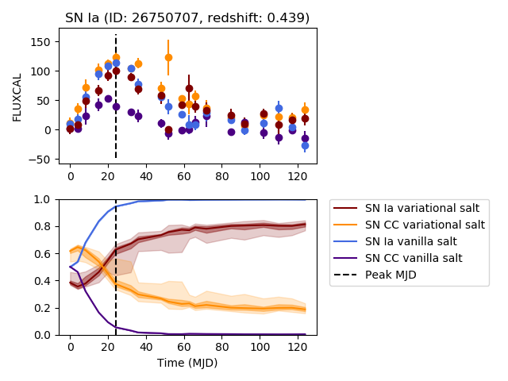

Visualization walkthrough
=========================

Activate the environment
-------------------------------

**Either use docker**

.. code::

    cd env && python launch_docker.py (--use_cuda optional)

**Or activate your conda environment**

.. code::

    source activate <conda_env_name>

Exploring the dataset
----------------------

.. code::

	python run.py --data --dump_dir tests/dump  # build the database
	python run.py --explore_lightcurves --dump_dir tests/dump

Outputs: ``.png`` files in the ``tests/dump/explore`` folder.
You should obtain something that looks like this:

Predictions as a function of time
-------------------------------------------

Assuming you have a trained model stored under ``tests/dump/models/vanilla_S_0_CLF_2_R_None_saltfit_DF_1.0_N_global_lstm_32x2_0.05_128_True_mean``
and that you have already created the database as above:

.. code::

	python run.py --plot_lcs --dump_dir tests/dump --model_files tests/dump/models/vanilla_S_0_CLF_2_R_None_saltfit_DF_1.0_N_global_lstm_32x2_0.05_128_True_mean/vanilla_S_0_CLF_2_R_None_saltfit_DF_1.0_N_global_lstm_32x2_0.05_128_True_mean.pt

Outputs: a figure folder under ``tests/dump/lightcurves/vanilla_S_0_CLF_2_R_None_saltfit_DF_1.0_N_global_lstm_32x2_0.05_128_True_mean``.

This folder contains the plot of several lightcurves and the predictions made by the neural network referred to by the ``model_files`` argument.

Below is a sample plot:

Predictions + uncertainty for bayesian models
-------------------------------------------------------

Assuming you have a variational RNN model stored under ``tests/dump/models/variational_S_0_CLF_2_R_None_saltfit_DF_1.0_N_global_lstm_32x2_0.05_128_True_mean_WD_1e-07``
and that you have already created the database as above:

.. code::

	python run.py --plot_lcs --dump_dir tests/dump --model_files tests/dump/models/variational_S_0_CLF_2_R_None_saltfit_DF_1.0_N_global_lstm_32x2_0.05_128_True_mean_WD_1e-07/variational_S_0_CLF_2_R_None_saltfit_DF_1.0_N_global_lstm_32x2_0.05_128_True_mean_WD_1e-07.pt

Outputs: a figure folder under ``tests/dump/lightcurves/variational_S_0_CLF_2_R_None_saltfit_DF_1.0_N_global_lstm_32x2_0.05_128_True_mean_WD_1e-07``.

This folder contains the plot of several lightcurves and the predictions made by the neural network referred to by the ``model_files`` argument.
Several predictions are sampled at each timestep and the prediction contours at 68% and 94% are shown.

Below is a sample plot:

Predictions from multiple models
-------------------------------------------

To compare the predictions from multiple models, simply call the above, while providing multiple ``model_files``

.. code::

	python run.py --plot_lcs --dump_dir tests/dump --model_files tests/dump/models/variational_S_0_CLF_2_R_None_saltfit_DF_1.0_N_global_lstm_32x2_0.05_128_True_mean_WD_1e-07/variational_S_0_CLF_2_R_None_saltfit_DF_1.0_N_global_lstm_32x2_0.05_128_True_mean_WD_1e-07.pt tests/dump/models/vanilla_S_0_CLF_2_R_None_saltfit_DF_1.0_N_global_lstm_32x2_0.05_128_True_mean/vanilla_S_0_CLF_2_R_None_saltfit_DF_1.0_N_global_lstm_32x2_0.05_128_True_mean.pt

Outputs: a figure folder under ``tests/dump/figures/multimodel_early_prediction``.

This folder contains the plot of several lightcurves and the predictions made by the neural networks referred to by the ``model_files`` argument.

Below is a sample plot:

Science plots
-------------------------------------------

The plots of the paper can be reproduced by running

.. code::

	python run_paper.py